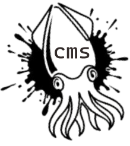

#  BalaKutaK CMS

[](https://opensource.org/licenses/MIT)
[](https://laravel.com)
[](#)

**BalaKutaK** adalah sebuah Content Management System (CMS) berbasis open source yang dirancang untuk memberikan kemudahan, fleksibilitas, dan kebebasan dalam membangun serta mengelola website secara efisien. Dikembangkan dengan semangat kolaborasi, BalaKutaK hadir sebagai solusi bagi institusi pendidikan, organisasi, hingga komunitas digital yang membutuhkan platform web yang ringan, adaptif, dan elegan.

---

## ✨ Fitur Utama (Premium Features)

*   **💎 Premium Immersive UI**: Antarmuka modern dengan efek gradasi sinematik, animasi AOS, dan elemen dekoratif yang mewah.
*   **🎨 Dynamic Theme Engine**: Mendukung pergantian tema secara instan (tersedia tema *Navy Blue* & *Green Gold*).
*   **🤝 Sponsor Management**: Modul khusus untuk mengelola logotipe mitra dan sponsor yang terintegrasi di footer.
*   **🎓 Academic Suite**: Pengelolaan lengkap untuk kalender akademik, layanan kurikulum, profil dosen, dan agenda kegiatan.
*   **🛡️ Secure Admin Panel**: Didukung oleh AdminLTE 3 dengan sistem Role & Permission yang ketat (Super Admin & Admin).
*   **📱 Ultra Responsive**: Tampilan optimal di perangkat mobile, tablet, maupun desktop.
*   **🔍 SEO Optimized**: Struktur HTML semantik, meta tag dinamis, dan performa loading yang cepat.

---

## 🚀 Panduan Instalasi (Quick Start)

Ikuti langkah-langkah berikut untuk menjalankan BalaKutaK CMS di lingkungan lokal Anda:

### 1. Persyaratan Sistem
*   PHP >= 8.2
*   Composer
*   Node.js & NPM
*   MySQL / MariaDB

### 2. Langkah Instalasi
```bash
# Clone repository
git clone https://github.com/riyantoabuwinner/balakutak.git
cd balakutak

# Install dependensi PHP
composer install

# Install dependensi Frontend
npm install
npm run build

# Salin konfigurasi environment
cp .env.example .env

# Generate application key
php artisan key:generate
```

### 3. Konfigurasi Database
Sesuaikan pengaturan database di file `.env`:
```env
DB_CONNECTION=mysql
DB_HOST=127.0.0.1
DB_PORT=3306
DB_DATABASE=nama_database_anda
DB_USERNAME=root
DB_PASSWORD=
```

### 4. Migrasi & Seeding (PENTING)
Jalankan perintah ini untuk membangun struktur tabel dan memasukkan data identitas BalaKutaK (termasuk logo & branding):
```bash
php artisan migrate:fresh --seed
php artisan storage:link
```

### 5. Jalankan Server
```bash
php artisan serve
```
Akses website di: `http://127.0.0.1:8000`
Akses Admin di: `http://127.0.0.1:8000/admin` (Login Default: `superadmin@prodi.ac.id` | `password`)

---

## 🛠️ Stack Teknologi

*   **Backend**: Laravel 11 (PHP 8.2+)
*   **Frontend**: Bootstrap 5, Alpine.js, Swiper.js, AOS (Animate On Scroll)
*   **Admin Template**: AdminLTE 3
*   **Icons**: Font Awesome 6
*   **Typography**: Inter & Poppins (Google Fonts)

---

## 🦑 Filosofi Nama
**BalaKutaK** (Cumi-cumi/Sotong) dipilih sebagai simbol fleksibilitas, kecerdasan, dan kemampuan untuk beradaptasi dengan cepat di berbagai lingkungan (seperti cumi-cumi yang dapat berubah warna dan bentuk). BalaKutaK CMS diharapkan menjadi platform yang lincah namun kokoh dalam memenuhi kebutuhan digital penggunanya.

---

## 📄 Lisensi
BalaKutaK CMS adalah software open-source yang dilisensikan di bawah [MIT license](https://opensource.org/licenses/MIT).

---

**Dikembangkan dengan ❤️ oleh [riyantoabuwinner](https://github.com/riyantoabuwinner)**
